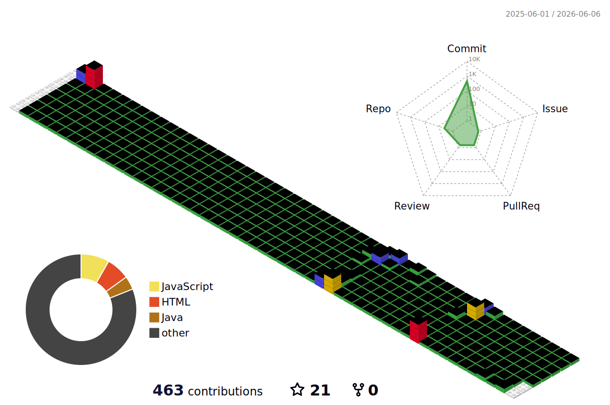

<div align="center">


</div>


```
💻  Backend Developer
✍️  복잡함을 줄이고, 구조로 말합니다.
📍  Gyeonggi-do, Korea
```

<br><br>

## 🛠 Tech Stack

**Language**


**Framework**


**Database**


**ORM · SQL Mapper**


**Build**


**Server**


**Infra · DevOps**


**Frontend · Others**


**Tools**


<br><br>

## 🔗 Links

- ✍️ Blog → [velog.io/@yoonddo](https://velog.io/@yoonddo)


<div align="center">

<!-- 3D Contribution Graph (profile-3d-contrib) -->


</div>
